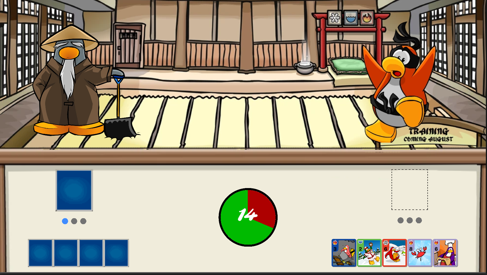

## Introduction
This is an implementation of the classic club penguin card game made in Godot Engine. This ISN'T an exact replica of the game but an implementation of the base mechanics with some changes. All the cards and sprites where taken from the following website.

> https://clubpenguin.fandom.com/wiki/Card-Jitsu

## Basic Game Info
In this game, the player is a card-jitsu student challenging their Sensei. Both the player and the Sensei are given a hand of 5 random cards. Each card has a Type and a Power stat:

 

The player's card battles against the Sensei's card. The winner card will be determined by typing following this chart:

| Type  | Wins Against | Loses Against |
| ----- | ------------ | ------------- |
| Water | Fire         | Ice           |
| Ice   | Water        | Fire          |
| Fire  | Ice          | Water         |

- In case of a typing tie, the card with the highest power wins the round.
- In case of a typing tie AND a power tie, the round is tied and no one wins a point.

## Turn Logic 
To win the game the player must win three points before the Sensei does. Each point represents a succesfull turn, in wich the player's card beat the Sensei's. Sensei's cards are picked randomly by the game. The player chooses a card by clicking and dragging it into the square slot.

Under both the player and the Sensei's slots there's three dots that represent their points. Each blue dot is a point won and each gray dot is a point needed to defeat the rival. Once someone's three dots are blue, they win.

The player only has 20 seconds to choose their card. The clock on the center of the screen indicates how much time is left for that choice. If the player hasn't picked a card when the 20s timer runs out, the game will randomly choose a card for them.

Once the game is done, the player will be shown a game over screen with a button to reset and play again.

## How To Play
The game is uploaded to itch.io.

>https://who-li.itch.io/card-jitsu 